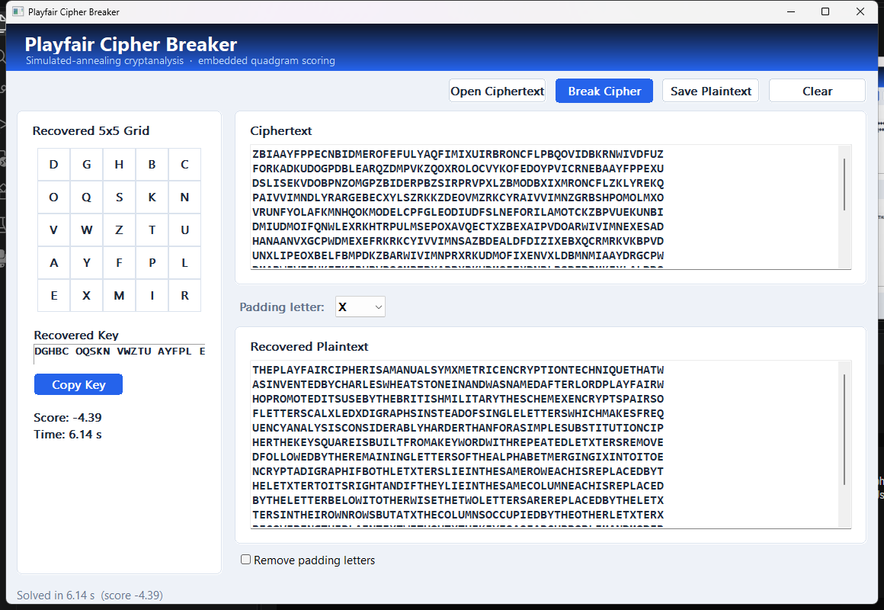

# Playfair Cipher Breaker

A self-contained Windows GUI application for cryptanalyzing Playfair ciphers.

The cryptanalysis is a C++ port of the Playfair cipher solver from
[Colossus](https://github.com/stblake/colossus) by **Samuel Thomas Blake
(stblake)**. This project is the standalone graphical implementation of that
solver: it reproduces the same simulated-annealing attack and the same
quadgram scoring, but packages it as a single desktop program with no external
solver, data file, or script interpreter required.



## Getting the application

There are two ways to get up and running.

### Option 1: Download the prebuilt executable

Download `PlayfairBreaker.exe` from the
[latest release](https://github.com/minouse3/playfair-cipher/releases/latest).
It is a portable Windows executable: no installer, external data file, or
runtime is required. Run it and continue with [Usage](#usage) below.

### Option 2: Build it yourself

Build the executable from source. See [Requirements](#requirements) and
[Building](#building) below.

## Features

- Load a plain-text ciphertext file and break it with one click.
- Recovered 5x5 key square displayed as both a grid and a copyable key string.
- Recovered plaintext shown with the padding letters in place, plus a toggle to
  strip the selected padding letter afterwards.
- Selectable padding letter (A-Z, default `X`).
- Live progress bar, elapsed time, and fitness score.
- Save the recovered plaintext to a text file.
- Single self-contained executable: the quadgram table is compiled into the
  binary, so nothing else needs to ship alongside it.

## How it works

The attack treats the Playfair key square as a permutation of the 25 symbols
(the alphabet with `J` merged into `I`) and searches for the permutation whose
decryption of the ciphertext scores best under an English quadgram model.

- **Search:** simulated annealing with 6 independent restarts.
- **Iterations:** 400,000 per restart.
- **Cooling:** geometric from an initial temperature of `0.08` down to `0.001`.
- **Backtracking:** at the start of each restart after the first, there is a
  30% chance to restart from the best square found so far rather than a random
  one.
- **Moves:** random cell swaps (80%), row swaps (8%), column swaps (8%), full
  reversal (2%), vertical flip (1%), horizontal flip (1%).
- **Score:** mean base-10 log probability per quadgram, using a table of
  26^4 = 456,976 quadgram frequencies. Unseen quadgrams receive a floor
  penalty.

Because the key square is small, a correct solve is usually found in well under
a minute on a typical machine.

## Requirements

- Windows (the GUI uses the Win32 API).
- [MSYS2](https://www.msys2.org/) with the MinGW-w64 toolchain, providing:
  - `g++` (C++17)
  - `objcopy`
  - `windres`
- Python 3 is only needed if you want to regenerate the quadgram table.

## Building

From the MSYS2 MinGW-w64 shell (or a prompt with the toolchain on `PATH`):

```bat
build.bat
```

This produces `PlayfairBreaker.exe` in the project root. The script embeds
`ngram_quad.bin` with `objcopy`, compiles the resource/manifest with `windres`,
and links the GUI. If `ngram_quad.bin` is missing, the script regenerates it
from the included `english_quadgrams.txt` (which requires Python 3).

## Usage

1. Run `PlayfairBreaker.exe`.
2. Click **Open Ciphertext** and choose a `.txt` file containing the ciphertext.
   Non-letter characters are ignored.
3. Click **Break Cipher**. Progress is shown while the solver runs.
4. Inspect the recovered grid, key, and plaintext. Use **Copy Key** to put the
   key on the clipboard.
5. If the plaintext was padded, tick **Remove padding letters** and pick the
   padding letter that was used (default `X`) to strip it.
6. Click **Save Plaintext** to write the result to a file.

## Console test mode

The solver can also be built without the GUI for quick checks:

```bat
g++ -O3 -std=c++17 -municode -DPF_CONSOLE_TEST -o PlayfairTest.exe ^
    playfair_breaker.cpp ngram_quad.o ^
    -lcomctl32 -lcomdlg32 -lgdi32 -luser32 -lshell32 -lole32

PlayfairTest.exe --test cipher.txt
```

Optional arguments after the ciphertext set the merged letter, its target, and
the padding letter, for example `--test cipher.txt J I X`.

## The quadgram table

`ngram_quad.bin` is a quantized 16-bit table over the full 26-letter alphabet,
prefixed with a 16-byte header (two little-endian doubles: the floor and the
scale). It is compiled into the executable, which is why no external data file
is needed at runtime.

The repository also includes `english_quadgrams.txt`, the raw quadgram
frequency table from [Colossus](https://github.com/stblake/colossus), so
`ngram_quad.bin` can be regenerated locally without fetching anything else. If
the binary is missing, `build.bat` regenerates it automatically (this requires
Python 3). You can also run the generator directly:

```bat
python tools\gen_ngram_bin.py english_quadgrams.txt ngram_quad.bin
```

Then rebuild the executable as described above.

## Project layout

```
playfair_breaker.cpp       solver core + Win32 GUI
playfair_breaker.rc        Windows resource script (embeds the manifest)
playfair_breaker.manifest  Common Controls v6 and DPI-awareness manifest
build.bat                  build script
ngram_quad.bin             quantized quadgram table, embedded into the binary
english_quadgrams.txt      raw quadgram frequencies from Colossus, used to
                           regenerate ngram_quad.bin
tools/gen_ngram_bin.py     generator for ngram_quad.bin
docs/screenshot.png        application screenshot used by this README
LICENSE                    MIT license text
```

## Credits

- Cryptanalysis method, simulated-annealing design, and quadgram approach:
  [Colossus](https://github.com/stblake/colossus) by Samuel Thomas Blake
  (stblake).
- This project: a standalone GUI implementation of the Colossus Playfair
  cipher solver.

## License

This project is released under the MIT License. It is derived from
[Colossus](https://github.com/stblake/colossus), which is also MIT licensed
(Copyright (c) 2023 Sam Blake). The original copyright notice is retained; see
the [LICENSE](LICENSE) file for the full text.